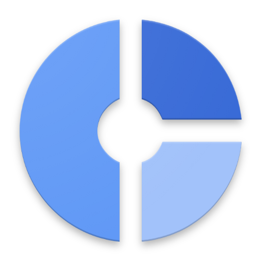

# chrome-supersize-reports
Demo HTML reports from Chromium's supersize analysis tool.

[FAQ](FAQ)

[Supersize](https://chromium.googlesource.com/chromium/src/+/master/tools/binary_size/README.md#Super-Size)
is a tool for collecting, archiving, and analyzing Chrome on Android's binary size.
It archives `.size` files on various builders so regressions can be quickly analyzed.

Supersize can generate interactive
[html reports](https://chromium.googlesource.com/chromium/src/+/master/tools/binary_size/README.md#Usage_html_report)
with display a breakdown of the symbols in a `.size` file.
Below is some sample output from the tool.

## Demos
- [monochrome-2018-06-20 _(Protytype)_](monochrome-2018-06-20)
- [monochrome-2018-06-26 _(MVP)_](monochrome-2018-06-26)
- [monochrome-2018-06-27 _(Method counting)_](monochrome-2018-06-27)
- [monochrome-diff-2018-06-27 _(Diff)_](monochrome-diff-2018-06-27)
- [monochrome-2018-06-28 _(Keyboard navigation)_](monochrome-2018-06-28)
- [monochrome-2018-07-03 _(Large data)_](monochrome-2018-07-03)
- [monochrome-2018-07-04 _(Group by component)_](monochrome-2018-07-04)
- [monochrome-2018-07-05 _(Filters)_](monochrome-2018-07-05)
- [monochrome-2018-07-06 _(Symbol type breakdown)_](monochrome-2018-07-06)
- [monochrome-2018-07-09](monochrome-2018-07-09)
- [monochrome-2018-07-10](monochrome-2018-07-10)
- [monochrome-2018-07-11](monochrome-2018-07-11)
- [monochrome-2018-07-12](monochrome-2018-07-12)
- [monochrome-2018-07-17 _(Upload custom data)_](monochrome-2018-07-17)
- [monochrome-2018-07-19 _(FAQ link)_](monochrome-2018-07-19)

## Source code
Located in `//tools/binary_size/` in the Chromium repository.
- [Chromium](https://chromium.googlesource.com/chromium/src.git/+/master/tools/binary_size/)
- [GitHub mirror](https://github.com/chromium/chromium/tree/master/tools/binary_size)

## See also:
- [supersize](https://chromium.googlesource.com/chromium/src/+/master/tools/binary_size/README.md#Super-Size)
- [agrieve.github.io/chrome/](https://agrieve.github.io/chrome/)
